<h1 align="center">ClaudeBar for Windows</h1>

<p align="center"><em><a href="README.md">English</a></em></p>

<p align="center">
  Un diminuto monitor en la <strong>bandeja del sistema de Windows</strong> para tu uso de
  <strong>Claude Code</strong> — lee tu <strong>cuota real de 5h / 7d</strong> desde el mismo
  endpoint que usa Claude Code, predice cuándo te quedarás sin cuota y grafica tu histórico.
  Todo local. Cero telemetría.
</p>

<p align="center">
  <a href="LICENSE"></a>
  <a href="https://github.com/Yovancas/claudebar-win/releases/latest"></a>
  
  
</p>

<p align="center">
  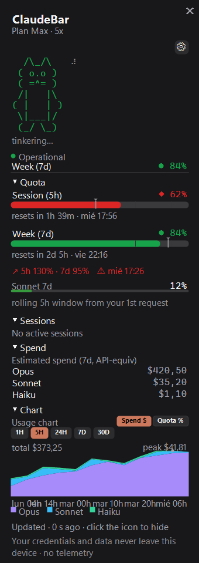
</p>

<p align="center"><sub><em>Sin afiliación con Anthropic. ClaudeBar solo lee la cuota que tu propia sesión de Claude Code ya tiene.</em></sub></p>

---

## ¿Qué es ClaudeBar?

Un pequeño icono se sienta junto a tu reloj y siempre muestra cuánta cuota de Claude llevas
gastada. Haz clic y se despliega un panel limpio con la foto completa: tus ventanas de **5 horas**
y **7 días** como **porcentajes reales** (directos de Anthropic, no una estimación), una
**predicción de ritmo de consumo** que te avisa antes de quedarte seco, un **gasto estimado** por
modelo, una **gráfica de uso** y un gatito ASCII que reacciona en vivo a tus sesiones en marcha.

Dos números, dos verdades — y ClaudeBar es honesto sobre cuál es cuál:

- **El % de cuota (5h / 7d) es REAL** — la cifra exacta que Anthropic le devuelve al propio Claude Code.
- **El gasto en $ es una ESTIMACIÓN** — un coste equivalente a la API calculado localmente desde tus transcripts. **No** es la factura de tu suscripción.

Está hecho en **C# / .NET 9 + WinForms**, con `Microsoft.Data.Sqlite` como única dependencia en
ejecución. Una versión Windows del [ClaudeBar](https://github.com/tddworks/ClaudeBar) de macOS, con
ideas de datos de [ccstatusline](https://github.com/sirmalloc/ccstatusline) y
[CodeZeno/Claude-Code-Usage-Monitor](https://github.com/CodeZeno/Claude-Code-Usage-Monitor), e
ideas de UI de [CodexBar](https://github.com/steipete/CodexBar) ([créditos](#créditos) completos abajo).

---

## Capturas

Tres temas — **Oscuro**, **Claro** y **CLI** (la captura de CLI está en modo de gráfica `Cuota %`):

<p align="center">
  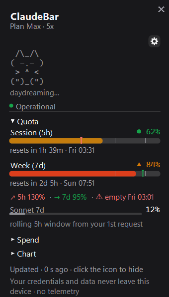
  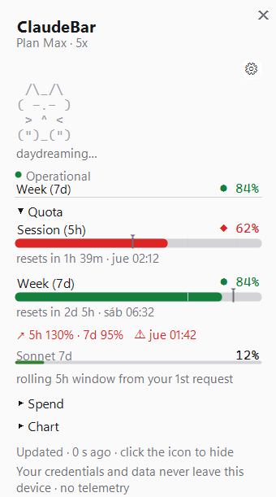
  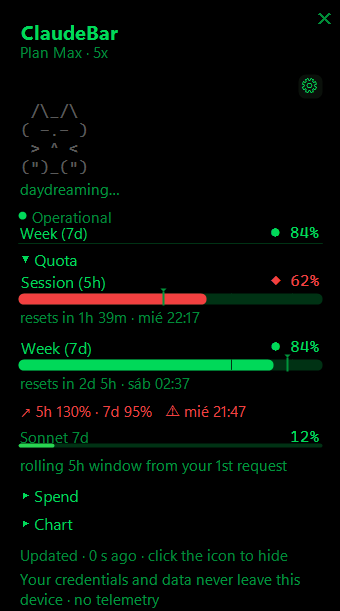
</p>

**Una sola pantalla de ajustes agrupados** — todas las opciones en una página única y limpia, con
filas maestras que controlan a sus dependientes (activa las sesiones en vivo y *entonces* se
despierta el control de la mascota). El panel limita su alto a ~65% de la pantalla y **se desplaza
con la rueda del ratón** (barrita fina a la derecha):

<p align="center">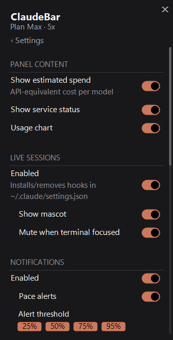</p>

El **icono de bandeja**, por estado / ritmo — muestra la mayor de tus dos ventanas y va degradando
de verde a ámbar a rojo según subes:

<p align="center"></p>

Y los estados **degradados / de accesibilidad**, para que siempre sepas qué significa un icono que
no está verde — desfasado `·old`, error `!`, las formas para daltónicos **triángulo**-aviso /
**diamante**-crítico, y el punto ámbar de atención (mostrado a 48px y a tamaño real de 16px sobre
una barra de tareas clara y otra oscura):

<p align="center">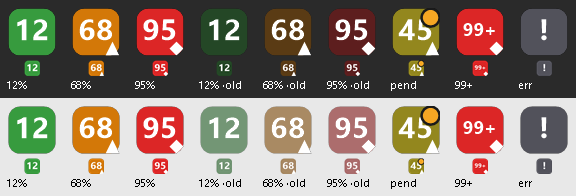</p>

<sub>Las capturas/animaciones usan datos de demo sintéticos.</sub>

---

## Funciones

### Icono de bandeja — legible de un vistazo, accesible por diseño

La insignia junto al reloj muestra la **mayor de tus dos ventanas** (sesión 5h / semanal 7d), para
que un único número refleje siempre tu límite más ajustado.

- **Tres modos** (Ajustes → Icono): **`%`** porcentaje usado (por defecto), **`▲`** ritmo (cuánto
  vas por delante del ritmo ideal de consumo), o **`%▲`** ambos — el número es el %, pero el *color*
  viene del ritmo, así tienes un aviso temprano aunque el número aún sea bajo.
- **Gradiente de color continuo** — interpola suavemente verde → ámbar → rojo en vez de saltos
  bruscos, usando dos umbrales configurables (por defecto **aviso 70% / crítico 90%**). Los tonos
  exactos vienen del tema activo.
- **Formas seguras para daltónicos** — más allá del color, una pequeña forma viaja en la esquina:
  **triángulo = aviso**, **diamante = crítico** (ninguna cuando vas bien). Dibujada en el mismo
  color auto-contrastado que el número. El mismo glifo `●/▲/◆` se repite en la cabecera del panel.
  *Siempre activo, por diseño.*
- **Texto auto-contrastado** — el número **no** está fijado a blanco. ClaudeBar calcula la
  luminancia perceptual del color de la insignia y voltea el texto a negro o blanco para que siga
  siendo legible sobre una barra de tareas clara **u** oscura.
- **Nítido a cualquier DPI** — renderizado internamente a 48px y reescalado por Windows. A ≥100%
  muestra `99+` (nunca un `100` recortado).
- **Punto ámbar de atención** — cuando las *sesiones en vivo* están activas y una sesión de Claude
  Code espera tu OK o tu input, aparece un pequeño punto ámbar en la esquina. Tu "Claude te
  necesita" silencioso, independiente del color de la cuota.
- **Estados degradados legibles** — si el dato se queda desfasado (sin conexión, límite de
  peticiones, o más viejo que 3× tu intervalo de refresco) el icono **se atenúa** en vez de
  mentirte; si no hay credenciales / el token caducó / estás limitado y no hay nada que mostrar, se
  convierte en una insignia neutra **`!`**.
- **Tooltip al pasar el cursor** — dos líneas compactas, p. ej. `5h 41% (↻2h 13m)` / `7d 63%
  (↻4d 2h)`, con una línea `⚠ datos previos (sin conexión)` cuando la última lectura no estaba
  fresca, y un mensaje de estado simple (`No autenticado` / `Sesión caducada` / `Límite de
  peticiones` / `Sin conexión`) cuando no hay dato alguno. (Windows limita los tooltips de bandeja
  a 127 caracteres, así que se recorta si hace falta.)

> Haz clic en el icono para abrir/cerrar el panel. Todo lo demás vive en un menú de clic derecho
> deliberadamente minimal: **Panel · Ajustes · Sesiones en vivo · Buscar actualizaciones · Salir**.

### Dashboard — la foto completa en un panel estrecho

Un popup sin bordes y con sombra (~340px de ancho) que **se auto-ajusta** a lo que actives. Las
secciones son un acordeón plegable (Cuota → Sesiones → Gasto → Gráfica); pliega lo que no necesites
y el panel se encoge para encajar.

- **Barras de cuota de 5h (sesión)** y **7d (semanal)** — **% real**, cada una con su cuenta atrás
  de reset (`resetea en 1h 40m · mié 04:18`), coloreada por **ritmo**. Una nota al pie te recuerda
  que la ventana de 5h es *móvil* — cuenta desde tu primera petición, no desde una hora fija del reloj.
- **Línea de ritmo con ETA** — `↗ 5h XX% · 7d XX%` (usado% vs el ideal según cuánto de la ventana
  ha transcurrido; más de 100% = vas por delante del ritmo), coloreada por la peor de las dos
  ventanas, con un **`⚠` + tiempo estimado** si se proyecta que te quedes sin cuota *antes* del reset.
- **Límites semanales por modelo** — mini-barras compactas `Opus 7d` / `Sonnet 7d` cuando tu plan
  los desglosa.
- **Cabecera de vistazo** — la ventana más utilizada en una sola línea (`Sesión (5h)  ◆ 87%`), más
  el punto de **estado del servicio** — sin duplicar la barra completa de abajo.
- **Gasto estimado por modelo** — `$` por modelo en una ventana configurable, el mayor primero.
  *Estimación equivalente a la API, no tu factura* (ver [De dónde sale el dato](#de-dónde-sale-el-dato)).

#### Gráfica de uso — dos modos, cinco rangos

Una mini-gráfica que puedes alternar entre dos vistas con un toggle `Gasto $ | Cuota %`:

- **`Gasto $`** — área apilada de coste-equivalente por modelo (Opus / Sonnet / Haiku / otros), con
  un `Total $X.XX` acumulado y una leyenda que muestra **solo las series con datos**.
- **`Cuota %`** — tu utilización *real* en el tiempo, con un **selector de ventana `5h | 7d` que
  solo aparece en este modo**.
- Ambos modos **anotan el pico** con un punto etiquetado (`máx $X.XX` / `máx X%`).
- Rangos: **1H / 5H / 24H / 7D / 30D** (siempre la ventana más reciente hasta *ahora*).

### Sesiones en vivo y la mascota

Actívalo y ClaudeBar verá — en tiempo real — qué está haciendo cada sesión de Claude Code abierta,
dibujado a través de un pequeño **gato ASCII** que vive en la cabecera del panel. Mecánica completa
en [Sesiones en vivo y hooks](#sesiones-en-vivo-y-hooks); la versión corta:

- Una máquina de estados de **6 fases** (en reposo · trabajando · espera tu OK · tu turno ·
  compactando · terminada) gobierna la **cara** del gato, su **color de humor** y el punto de
  atención de la bandeja.
- **Verbos juguetones, rotativos y localizados** bajo el gato (`pensando…`, `cocinando…`,
  `te toca…`), un **parpadeo natural** (con jitter, no metronómico), un **spinner braille**
  mientras trabaja, un **rebote de atención** cuando una sesión te necesita, y una **celebración de
  reset** cuando tu cuota se renueva.
- Se enciende/apaga con **Mostrar mascota** (un gatito compacto de 4 líneas, por diseño).

<p align="center">
  
  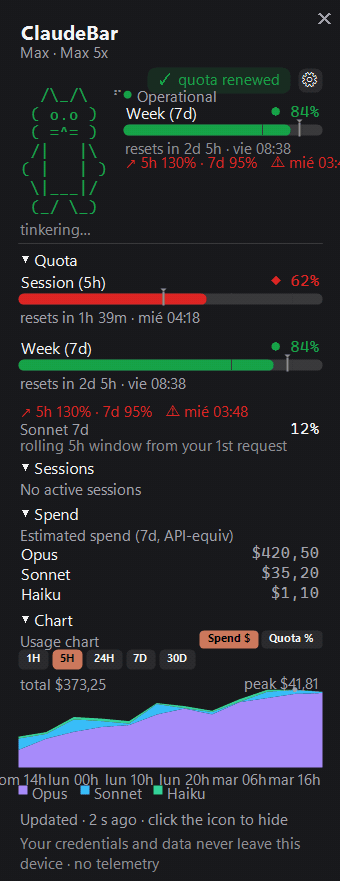
</p>

> Con la mascota visible pero las sesiones en vivo **desactivadas**, seguirás viendo un gato *en
> reposo* de ambiente — simplemente no cobra vida hasta que los hooks están instalados.

### Notificaciones proactivas

Toasts de Windows desde el icono de bandeja, todos bajo un único interruptor maestro de
**Notificaciones**:

- **Avisos de hitos** — `🟢🟡🟠🔴` cuando tu uso **cruza al alza** los umbrales 25 / 50 / 75 / 95%
  (cada uno activable). Solo se dispara en un cruce ascendente — un salto de 40→80 notifica **una
  vez** (el 75) — y **se rearma tras un reset**. La primera lectura solo siembra el estado, así que
  nunca spamea al arrancar.
- **Avisos de ritmo** — `⚠ Ritmo de cuota`: si tu ritmo de consumo proyecta agotar una ventana
  *antes* de su reset, te da la ventana (sesión 5h / semanal 7d) y el **tiempo estimado de
  agotamiento**. Una vez por episodio; se rearma cuando la proyección se aclara.
- **Toasts de sesión en vivo** — `Claude espera tu OK en {proyecto}` / `Claude terminó en
  {proyecto}` cuando una sesión cambia, con **silenciar-si-la-terminal-tiene-foco** (activado por
  defecto): si la ventana de esa sesión ya está en primer plano, ClaudeBar se queda callado — ya
  estás mirando.

### Aspecto y tacto

- **Arrástralo donde quieras** — agarra cualquier parte vacía del panel y suéltalo donde te guste;
  recuerda el sitio. O elige una esquina/centro predefinidos en Ajustes.
- **Opacidad ajustable**, **Fijado** (no se cierra solo al hacer clic fuera) y **Siempre encima**.
- **Temas** — Sistema / Oscuro / Claro / CLI, más **importar una paleta `.itermcolors`**.
- **9 idiomas** — Sistema + English, Español, Nederlands, Français, Deutsch, 日本語, 한국어,
  繁體中文 (tanto el tema como el idioma siguen por defecto tu configuración de Windows).

<p align="center">
  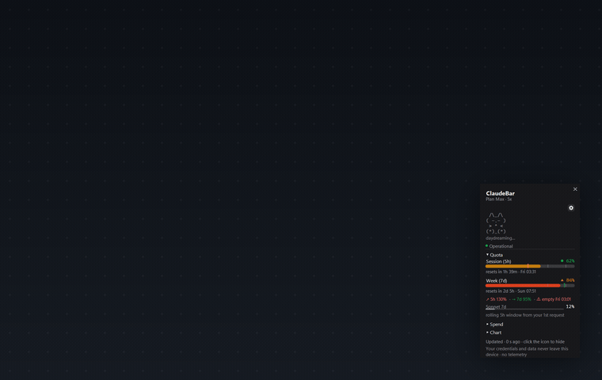
  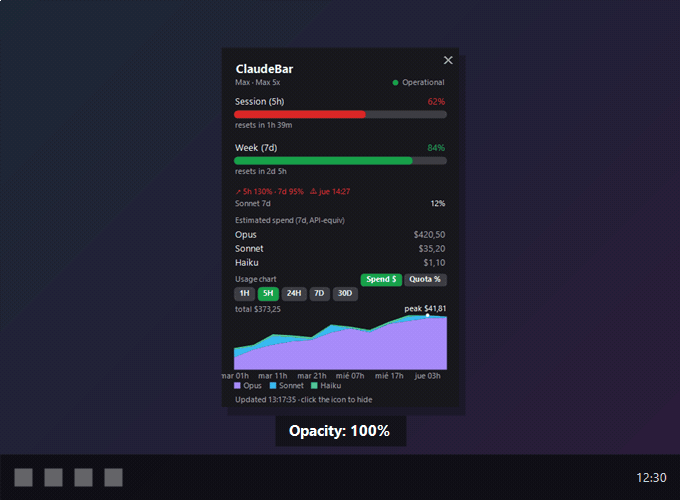
</p>

#### Microinteracciones, reducir movimiento y ~0 CPU en reposo

El panel **aparece con fade y entrada escalonada**, las barras y los números hacen **tween** hasta
su objetivo (el color salta para que nunca parpadee), las filas **se realzan al pasar el cursor**, y
un reset de cuota recibe un pequeño **destello**.

<p align="center">
  
  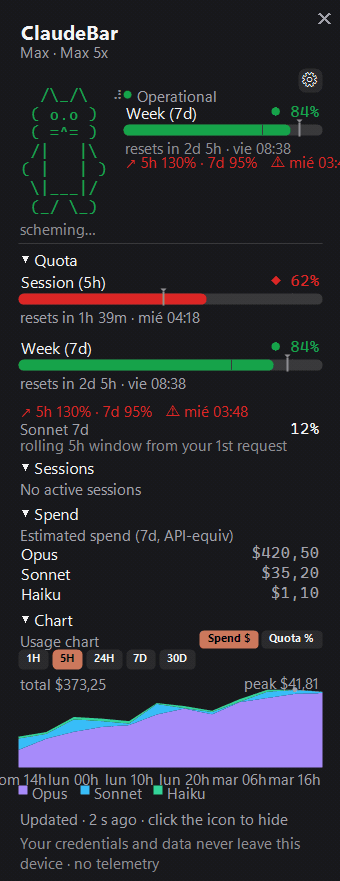
</p>

Dos cosas importan en una app que corre todo el día:

- **Reducir movimiento** — un solo interruptor colapsa **todas** las animaciones (fade, escalonado,
  tween, hover, rebote, spinner, celebración) a su estado final estático. Es un toggle real de
  accesibilidad/preferencia, **desactivado por defecto**, y **no** sigue automáticamente el ajuste
  del sistema operativo (tu decisión, no la de Windows).
- **~0 CPU cuando está oculto** — el motor de animación solo gasta ciclos cuando el panel está
  **visible y algo se mueve de verdad** (tick de ~33 ms). ¿Panel visible pero inactivo? Tick de
  ~1 s, solo para la cuenta atrás del reset. **¿Panel oculto? El temporizador para del todo.** Sin
  impuesto de animación en segundo plano para una app de bandeja 24/7.

---

## De dónde sale el dato

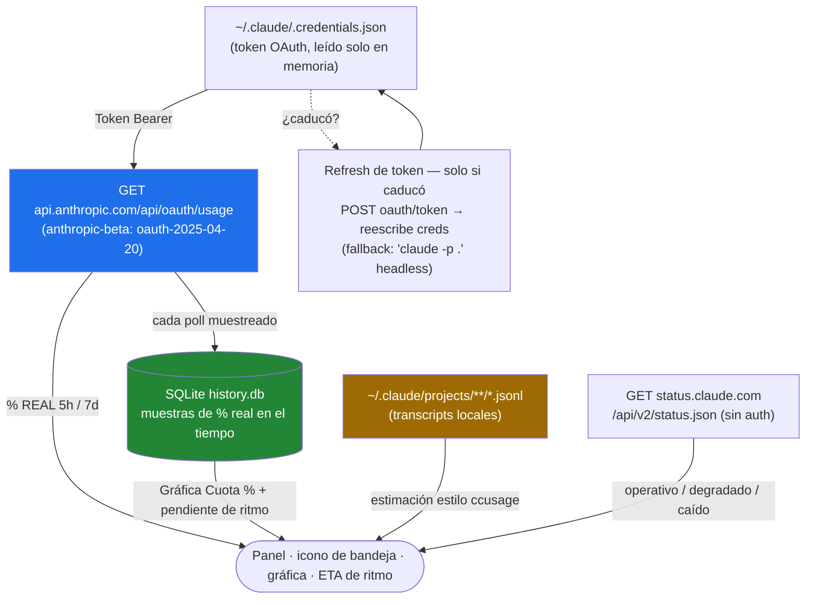

1. **Cuota real (principal).** `GET https://api.anthropic.com/api/oauth/usage` con tu token OAuth
   local. Devuelve `five_hour` / `seven_day` (más `seven_day_opus` / `seven_day_sonnet`) con
   `utilization` (%) y `resets_at` — los **mismos límites que respeta Claude Code** — y un flag de
   si está activado el **uso extra** de pago. Ante un HTTP 429 hace backoff (respetando
   `Retry-After`, o si no ~300s) y sirve el **último dato bueno** en vez de machacar la API.
2. **Histórico de % real.** La API de uso solo da un *snapshot*, así que cada poll con éxito se
   muestrea en SQLite (`%APPDATA%\ClaudeBarWin\history.db`, limitado a una vez/60s, podado tras 40
   días). Es la **única** fuente de la línea de tu gráfica `Cuota %` y del ETA de ritmo — por eso
   **empieza vacío y se va llenando** según corre la app.
3. **Ritmo + ETA.** Ritmo = usado% vs el ideal según cuánto de la ventana ha transcurrido (funciona
   desde el minuto uno). El ETA extrapola desde la pendiente reciente de tu histórico de %,
   ignorando las caídas causadas por los resets de ventana.
4. **Refresh de token — solo cuando caducó.** Si el token expiró, ClaudeBar lo refresca él mismo
   (`POST platform.claude.com/v1/oauth/token`) y reescribe `~/.claude/.credentials.json`
   **preservando todo lo demás**, con un `claude -p .` headless como fallback. Solo actúa cuando el
   token *ya* está caducado, así que nunca le pelea el token a Claude Code.
5. **Estado del servicio.** `GET status.claude.com/api/v2/status.json` (público, sin auth),
   cacheado ~2 min.
6. **Gasto estimado (secundario).** Parsea tus transcripts `.jsonl` locales (el método `ccusage`)
   a una cifra en USD por modelo usando los **precios de lista públicos de la API de Anthropic**
   (por 1M de tokens: **Opus** $15 in / $75 out, **Sonnet** $3 / $15, **Haiku** $1 / $5, más las
   tarifas correspondientes de cache-write / cache-read). Es una **estimación equivalente a la API,
   no el cargo de tu suscripción** — y está etiquetada como `equiv. API` en todas partes. (Los
   modelos desconocidos/sintéticos cuentan como $0 hasta que se conoce su precio.)

### Privacidad — y puedes verificarlo

- **El token se usa solo para leer *tu propio* uso**, y su único destino es la propia API de
  Anthropic. **Nunca se almacena, loguea ni se envía a ningún otro sitio**, y ClaudeBar **nunca lo
  persiste**.
- **Cero telemetría.** Nada sobre ti sale de tu máquina.
- La etiqueta del plan (`Max · 5x`, `Pro`, …) se lee **solo de campos no secretos** del fichero de
  credenciales (`subscriptionType` / `rateLimitTier`) — el token nunca se toca para ello.
- El **sello de privacidad se renderiza dentro del propio panel** — es una declaración que puedes
  leer en la app, no solo una promesa en este README.

---

## Instalación

### Opción 1 — Descargar el instalador (recomendado)

Coge `ClaudeBarWin-Setup-x.y.z.exe` de la
**[última release](https://github.com/Yovancas/claudebar-win/releases/latest)** y ejecútalo.

- **Por usuario, sin admin** (se instala en `%LOCALAPPDATA%\Programs\ClaudeBarWin`), **autocontenido
  — no necesita .NET**, hecho con Inno Setup.
- El icono aterriza en la bandeja del sistema. En **Windows 11** un icono nuevo se esconde en el
  desbordamiento `^` — arrástralo a la barra de tareas para fijarlo.
- **Las actualizaciones se instalan solas** (ver abajo), o lanza una desde el menú de clic derecho →
  *Buscar actualizaciones*.

> **SmartScreen** puede avisar porque el `.exe` no está firmado → **Más información → Ejecutar de
> todas formas**.

### Opción 2 — winget

```powershell
winget install Yovancas.ClaudeBarWin
```

*Disponible una vez el manifest se mergee en el repo comunitario de winget. Aviso: el manifest
publicado actualmente aún declara un `0.1.0` viejo y figura como `portable` — hasta que se actualice,
la descarga del instalador (Opción 1) es la vía fiable.*

### Opción 3 — compilar desde el código

Ver [Compilar desde el código](#compilar-desde-el-código).

**La auto-actualización** es silenciosa y segura: una comprobación en segundo plano al arrancar y
cada 6h contra un **appcast firmado con Ed25519** en GitHub (la clave privada de firma nunca está en
el repo). Cuando aceptas, descarga el instalador firmado, verifica la firma, intercambia el `.exe`
en ejecución y se relanza.

**Iniciar con Windows** — Ajustes → Sistema → *Iniciar con Windows*. Crea/borra un acceso directo en
la carpeta de Inicio — **sin registro, sin admin**, totalmente reversible.

---

## Requisitos

- **Windows 10 / 11 (x64)**.
- **Claude Code** (CLI o app) instalado y con sesión iniciada — ClaudeBar lee tu token OAuth local
  (`~/.claude/.credentials.json`) y tus transcripts para mostrar la cuota real y estimar el gasto.
  Nada sale de tu máquina. Sin credenciales locales muestra `No autenticado` y no hay cuota que
  mostrar.
- Nada más para ejecutar el build de la release. Para **compilar desde el código**: **.NET SDK 9**
  (vale una instalación user-local en `%USERPROFILE%\.dotnet`, sin admin).

---

## Configuración

Abre el dashboard y pulsa el **⚙** (arriba a la derecha) — **toda la configuración vive en una sola
pantalla agrupada**. El panel nunca se come la pantalla: limita su alto a ~65% y el contenido **se
desplaza con la rueda del ratón**. Las filas maestras controlan a sus dependientes: desactiva
**Notificaciones** y los avisos de ritmo/hitos se atenúan; desactiva **Sesiones en vivo** y los
controles de mascota/silenciar se atenúan.

| Grupo | Qué contiene |
|---|---|
| **Contenido del panel** | Gasto estimado · Estado del servicio · Gráfica de uso |
| **Sesiones en vivo** | *maestra* Activadas (instala/quita los hooks de Claude Code) → **Mostrar mascota** · Silenciar si la terminal tiene foco |
| **Notificaciones** | *maestra* Activadas → Avisos de ritmo · Hitos 25 / 50 / 75 / 95 |
| **Frecuencia de actualización** | 30s · 1m · 5m · 15m |
| **Icono** | Modo `%` / `▲` / `%▲` · Umbral de color 70/90 · 80/95 · 60/85 |
| **Apariencia** | Tema Sistema/Oscuro/Claro/CLI · Posición · Opacidad · Fijado · Siempre encima · Reducir movimiento |
| **Sistema** | Iniciar con Windows · Idioma (Sistema + 8) |
| **Acerca de** | Versión · Importar `.itermcolors…` |

Dos acciones son **sensibles** — piden confirmación y hacen copia de seguridad primero: activar las
**sesiones en vivo** (escribe `~/.claude/settings.json`) e **importar un tema**. El menú de clic
derecho (icono de bandeja o panel) se mantiene minimal: *Panel · Ajustes · Sesiones en vivo · Buscar
actualizaciones · Salir*. Los ajustes se guardan en `%APPDATA%\ClaudeBarWin\config.json`.

---

## Sesiones en vivo y hooks

> **Opt-in y desactivado por defecto.** Es la única función que toca tu configuración de Claude
> Code, así que es la única para la que ClaudeBar pide permiso.

Actívalo y ClaudeBar consigue una **vista en tiempo real de cada sesión de Claude Code abierta** —
nombre del proyecto y fase actual — que gobierna la mascota y el punto de atención de la bandeja.

**Cómo funciona.** Claude Code dispara un hook → un diminuto `claudebar-hook.ps1` lee el evento de
stdin → lo reenvía como una línea JSON por un named pipe local (`\\.\pipe\claudebar`) → ClaudeBar
actualiza la mascota y la lista de sesiones. El script del hook es **fire-and-forget**: si ClaudeBar
no está abierto o el pipe no responde en 200 ms, sale en silencio (`exit 0`) y **nunca bloquea ni
rompe tu sesión**. Soporta varias sesiones a la vez; los nombres de proyecto vienen del directorio
de trabajo de cada sesión; las sesiones se podan tras 10 minutos de silencio.

**Las 6 fases** (cada una elige la cara del gato, su color, y si recibes un toast):

| Fase | Cara | Qué hace el gato |
|---|---|---|
| **En reposo** | `-.-` | relajado, estático (sin animación) |
| **Trabajando** | `o.o` | atento, parpadea, el spinner braille gira |
| **Espera tu OK** | `O.O` | ojos abiertos que pulsan — *"¿lo apruebas?"*, rebota, el punto de bandeja se pone ámbar |
| **Tu turno** | `^.^` | contento, te toca — guiña a `^.-`, punto de bandeja ámbar |
| **Compactando** | `@.@` | mareado, comprimiendo memoria, el spinner gira |
| **Terminada** | `x.x` | KO, estático |

El gato es ASCII dibujado a mano (clean-room), un gatito compacto de 4 líneas:

```
  /\_/\
 ( o.o )
  > ^ <
 (")_(")
```

Por dentro la mascota es más quisquillosa de lo que parece: **parpadeo con jitter** (lento en reposo
~2.6s, urgente ~0.5s cuando te necesita), un **spinner braille** (`⠋⠙⠹⠸⠼⠴⠦⠧⠇⠏`) solo mientras
trabaja, **verbos rotativos juguetones** localizados a tu idioma, un **humor** con histéresis
(Alerta→ámbar, Contento→verde) para que no parpadee, un **rebote de atención** (un boing `OutBack`
de 3 saltos cada ~3.2s mientras una sesión espera), y una **celebración de reset** (destello
`✓ cuota renovada` + gato Contento) cuando una ventana se renueva. Todo es determinista y respeta
**Reducir movimiento**.

### ¿Es seguro? Sí — esto es exactamente lo que hace

Activar/desactivar las sesiones en vivo edita `~/.claude/settings.json`, que puede estar en uso por
sesiones corriendo 24/7. Por eso ClaudeBar tiene cuidado:

- **Confirmación primero**, con el botón por defecto del diálogo en **No** (un Enter accidental no
  hace nada).
- **Backup con timestamp** antes de cualquier escritura:
  `settings.json.claudebar-bak-YYYYMMDD-HHmmss` (la confirmación te dice la ruta).
- **Merge idempotente** — engancha 10 eventos (`UserPromptSubmit`, `PreToolUse`, `PostToolUse`,
  `PermissionRequest`, `Notification`, `Stop`, `SubagentStop`, `SessionStart`, `SessionEnd`,
  `PreCompact`), nunca duplica entradas, y **nunca toca tus otros hooks** (marca los suyos por
  nombre de script).
- **Desinstalación limpia** — quita **solo** las entradas de ClaudeBar (elimina la clave si un
  evento se queda vacío), hace backup otra vez, borra el script y para el pipe. Tus otros hooks
  quedan byte a byte idénticos.

**Pegas honestas:** ejecuta un PowerShell por cada evento de hook (ligero, pero frecuente); los
eventos se **pierden** si ClaudeBar no está corriendo (no se encolan); y el silenciado por foco usa
una heurística de árbol de procesos que ocasionalmente puede caer en "sin foco" (así que recibirías
el toast igualmente).

---

## Compilar desde el código

Requiere el **.NET SDK 9** (vale una instalación user-local en `%USERPROFILE%\.dotnet`, sin admin):

```powershell
git clone https://github.com/Yovancas/claudebar-win.git
cd claudebar-win
.\run.ps1            # build + run (debug)
.\run.ps1 publish    # publish\ClaudeBarWin.exe autocontenido de un solo fichero (no necesita .NET para correr)
```

`scripts/release.ps1` corre el pipeline completo — bump de versión → publish → instalador Inno →
appcast firmado con Ed25519 → release de GitHub opcional. **La publicación está protegida tras
`-Publish`** (si no, es un dry-run local que no sube nada), y la **clave privada Ed25519 nunca vive
en el repo**.

---

## Comandos útiles

Son utilidades de desarrollo/diagnóstico; todas usan **datos sintéticos** y nunca tocan tu cuota
real.

| Comando | Qué hace |
|---|---|
| `.\run.ps1` | Compila y ejecuta (debug) |
| `.\run.ps1 publish` | `publish\ClaudeBarWin.exe` autocontenido de un solo fichero |
| `ClaudeBarWin.exe --report` | Imprime la cuota + ritmo + gasto actuales a consola y a `%TEMP%\claudebar-report.txt` (sin GUI) |
| `ClaudeBarWin.exe --render-demo` | Renderiza las capturas de los temas (`dashboard-dark` / `-light` / `-cli`, `tray-icons`) |
| `ClaudeBarWin.exe --render-test` | Renderiza `data` / `settings` / `mascot` / `tray-badges` + fotogramas de microinteracciones |
| `ClaudeBarWin.exe --render-gif` | Vuelca las secuencias de fotogramas de los GIF del README a `%TEMP%\claudebar-gif`, luego se ensamblan con ffmpeg (ver [Montar los GIF](#montar-los-gif)). El fotograma "hold" estabilizado de la secuencia `apertura/` es el panel completo expandido que se usa para el hero `dashboard-full`. |
| `ClaudeBarWin.exe --notify-demo` | Dispara los cuatro toasts de hitos 🟢🟡🟠🔴 en secuencia, luego sale |
| `ClaudeBarWin.exe --db-test` | Prueba de humo del store SQLite del histórico |
| `ClaudeBarWin.exe --dump-menu` | Imprime la estructura del menú de clic derecho |
| `ClaudeBarWin.exe --hook-test` | Conduce el pipe de sesiones en vivo con una secuencia de eventos falsa *(necesita una instancia corriendo con sesiones en vivo activas)* |

El estado vive bajo `%APPDATA%\ClaudeBarWin\`: `config.json` (ajustes), `history.db` (histórico de %
real), `last-state.json` (última lectura buena, para arranque instantáneo y modo sin conexión).

### Montar los GIF

`--render-gif` solo vuelca secuencias numeradas `frame_###.png` (una carpeta por animación:
`apertura/` · `mascota/` · `hover/` · `celebracion/`) bajo `%TEMP%\claudebar-gif`. Convierte cada
carpeta en un `.gif` en bucle con ffmpeg (pasada de paleta para colores limpios):

```powershell
$seq = "$env:TEMP\claudebar-gif\apertura"          # repetir por cada carpeta
ffmpeg -y -framerate 30 -i "$seq\frame_%03d.png" -vf "palettegen" "$seq\pal.png"
ffmpeg -y -framerate 30 -i "$seq\frame_%03d.png" -i "$seq\pal.png" `
  -lavfi "paletteuse" "assets\f3-apertura.gif"
```

Mapea las carpetas a `assets/f3-apertura.gif` · `assets/f3-mascota.gif` · `assets/f3-hover.gif` ·
`assets/f3-celebracion.gif`. El **hero `dashboard-full`** no tiene su propio comando — coge un único
fotograma "hold" estabilizado del final de `apertura/` (el panel completo expandido: banda de
mascota + barras de cuota + gasto por modelo + gráfica) y guárdalo como `assets/dashboard-full.png`.

---

## Desinstalar

- Sal desde el menú de bandeja (**Salir**), luego quita la app (instalador: Apps → desinstalar, o
  borra la carpeta `%LOCALAPPDATA%\Programs\ClaudeBarWin`; portable: borra `ClaudeBarWin.exe`).
- **Tus datos sobreviven a una desinstalación normal por diseño** — config + histórico viven en
  `%APPDATA%\ClaudeBarWin\`, *no* en la carpeta de la app. Para purgarlo todo, borra también esa
  carpeta.
- Si activaste *Iniciar con Windows*, desactívalo antes (o borra el acceso directo de
  `shell:startup`).
- Instalado por winget: `winget uninstall Yovancas.ClaudeBarWin`.

---

## Notas y FAQ

- **Desbordamiento de la bandeja en Windows 11** — un icono nuevo va al desbordamiento `^`;
  arrástralo a la barra de tareas para fijarlo.
- **Icono "desfasado" / atenuado** — el dato es más viejo que 3× tu intervalo de refresco (sin
  conexión, un enfriamiento por 429, o simplemente sin lectura fresca). El icono **se atenúa y el
  tooltip lo dice** en vez de mostrar un número viejo como si fuera en vivo. Los estados `·old` /
  `!` están en la tira de [tray-badges](#capturas) de arriba.
- **El refresh `claude -p .`** solo se dispara si el token está **caducado**; con Claude Code
  corriendo se mantiene fresco solo y esto rara vez ocurre.
- **`extra usage`** (uso de pago por desbordamiento) se lee de la API y se expone en `--report` (y
  en el `last-state.json` cacheado) — es un flag de diagnóstico, no se muestra en la UI del panel.
- **Real vs estimado, una vez más** — el **% de 5h/7d** es real (la propia cifra de Anthropic); el
  **gasto en $** es una **estimación local equivalente a la API**, no la factura de tu suscripción.
- El aviso de **SmartScreen** en el primer arranque es esperable (el `.exe` no está firmado).

---

## Créditos

Un port a Windows inspirado en [ClaudeBar](https://github.com/tddworks/ClaudeBar) (macOS), con ideas
de datos de [CodeZeno/Claude-Code-Usage-Monitor](https://github.com/CodeZeno/Claude-Code-Usage-Monitor)
y [ccstatusline](https://github.com/sirmalloc/ccstatusline), e ideas de UI de
[CodexBar](https://github.com/steipete/CodexBar).

**Sin afiliación con Anthropic.**

## Licencia

[MIT](LICENSE)
