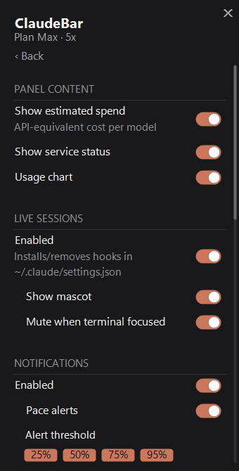
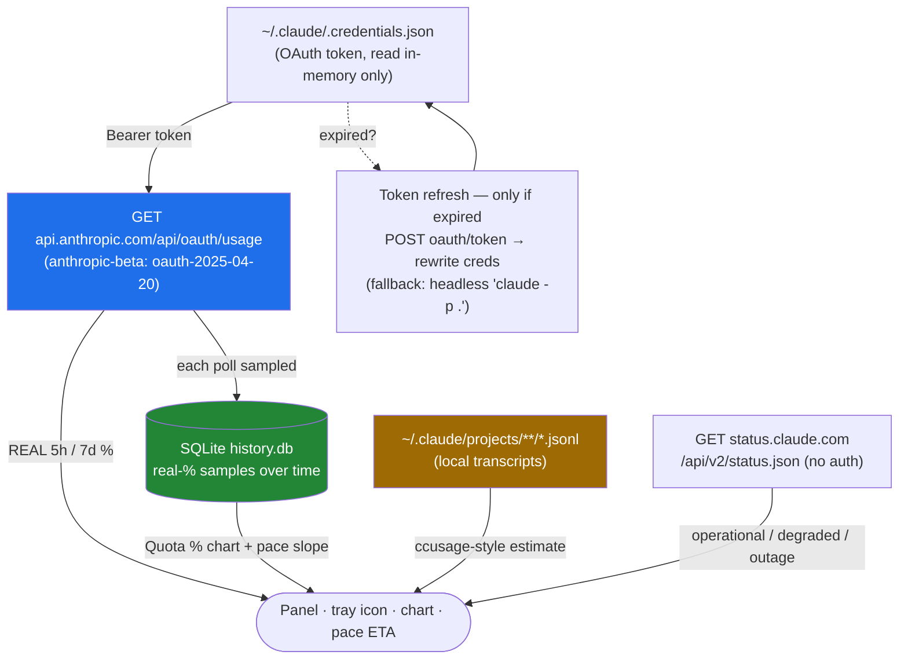

<h1 align="center">ClaudeBar for Windows</h1>

<p align="center"><em><a href="README.es.md">Español</a></em></p>

<p align="center">
  A tiny <strong>Windows system-tray</strong> monitor for your <strong>Claude Code</strong> usage —
  it reads your <strong>real 5h / 7d quota</strong> from the same endpoint Claude Code uses,
  predicts when you'll run out, and charts your history. All local. Zero telemetry.
</p>

<p align="center">
  <a href="LICENSE"></a>
  <a href="https://github.com/Yovancas/claudebar-win/releases/latest"></a>
  
  
</p>

<p align="center">
  
</p>

<p align="center"><sub><em>Not affiliated with Anthropic. ClaudeBar just reads the quota your own Claude Code session already has.</em></sub></p>

---

## What is ClaudeBar?

A small icon sits next to your clock and always shows how much of your Claude quota
you've burned. Click it and a clean panel slides open with the full picture: your **5-hour**
and **7-day** windows as **real percentages** (straight from Anthropic, not a guess), a
**burn-rate prediction** that warns you before you run dry, a per-model **spend estimate**, a
**usage chart**, and a little ASCII cat that reacts live to your running sessions.

Two numbers, two truths — and ClaudeBar is honest about which is which:

- **Quota % (5h / 7d) is REAL** — the exact figure Anthropic returns to Claude Code itself.
- **The $ spend is an ESTIMATE** — an API-equivalent cost computed locally from your transcripts. It is **not** your subscription bill.

It's **C# / .NET 9 + WinForms**, with `Microsoft.Data.Sqlite` as the only runtime dependency.
A Windows take on the macOS [ClaudeBar](https://github.com/tddworks/ClaudeBar), with data ideas
from [ccstatusline](https://github.com/sirmalloc/ccstatusline) and
[CodeZeno/Claude-Code-Usage-Monitor](https://github.com/CodeZeno/Claude-Code-Usage-Monitor), and
UI cues from [CodexBar](https://github.com/steipete/CodexBar) (full [credits](#credits) below).

---

## Screenshots

Three themes — **Dark**, **Light**, and **CLI** (the CLI shot is in `Quota %` chart mode):

<p align="center">
  
  
  
</p>

**One grouped settings screen** — every option on a single, clean page, with master rows that
gate their dependents (turn on live sessions, *then* the mascot control wakes up). The panel caps
its height at ~65% of your screen and **scrolls with the mouse wheel** (thin scrollbar on the right):

<p align="center">
  
  
</p>

The **tray icon**, by status / pace — it shows the higher of your two windows and shades from
green to amber to red as you climb:

<p align="center"></p>

And the **degraded / accessibility** states, so you always know what a non-green icon means —
stale `·old`, error `!`, the warn-**triangle** / critical-**diamond** colorblind shapes, and the
amber attention dot (shown at 48px and at real 16px size on a light and a dark taskbar):

<p align="center"></p>

<sub>Screenshots/animations use synthetic demo data.</sub>

---

## Features

### Tray icon — readable at a glance, accessible by design

The badge by the clock shows the **higher of your two windows** (5h session / 7d weekly) so a
single number always reflects your tightest limit.

- **Three modes** (Settings → Icon): **`%`** percent used (default), **`▲`** pace (how far
  ahead of the ideal burn-rate you are), or **`%▲`** both — number is the %, but the *color*
  comes from pace, so you get an early warning even while the number is still low.
- **Continuous color gradient** — smoothly interpolates green → amber → red instead of hard
  jumps, using two configurable thresholds (default **warn 70% / critical 90%**). Exact tones
  come from the active theme.
- **Colorblind-safe shapes** — beyond color, a small shape rides in the corner: **triangle =
  warn**, **diamond = critical** (none when you're OK). Drawn in the same auto-contrast color as
  the number. The same `●/▲/◆` glyph repeats in the panel header. *Always on, by design.*
- **Auto-contrast text** — the number is **not** hard-coded white. ClaudeBar computes the
  perceptual luminance of the badge color and flips the text black or white so it stays legible
  on a light **or** dark taskbar.
- **Crisp at any DPI** — rendered internally at 48px and downscaled by Windows. At ≥100% it
  shows `99+` (never a clipped `100`).
- **Amber attention dot** — when *live sessions* are on and a Claude Code session is waiting for
  your OK or your input, a small amber dot appears in the corner. Your silent "Claude needs you,"
  independent of the quota color.
- **Degraded states made legible** — if data goes stale (offline, rate-limited, or older than
  3× your refresh interval) the icon **dims** rather than lying to you; if there are no
  credentials / the token expired / you're rate-limited with nothing to show, it becomes a
  neutral **`!`** badge.
- **Tooltip on hover** — two compact lines, e.g. `5h 41% (↻2h 13m)` / `7d 63% (↻4d 2h)`, with a
  `⚠ previous data (offline)` line when the last fetch wasn't fresh, and a plain status message
  (`not signed in` / `session expired` / `rate limited` / `offline`) when there's no data at all.
  (Windows caps tray tooltips at 127 chars, so it's clipped to fit if needed.)

<p align="center">
  
</p>
<p align="center"><sub><em>The badge climbing 5→99%: the green→amber→red gradient, the colorblind triangle/diamond shapes kicking in, and the amber attention dot blinking independently of the quota color.</em></sub></p>

> Click the icon to open/close the panel. Everything else lives in a deliberately minimal
> right-click menu: **Dashboard · Settings · Live sessions · Check for updates · Exit**.

### Dashboard — the full picture in a narrow panel

A borderless, drop-shadowed popup (~340px wide) that **auto-sizes** to whatever you enable.
Sections are a collapsible accordion (Quota → Sessions → Spend → Chart); collapse what you don't
need and the panel shrinks to fit.

- **5h (session)** and **7d (weekly)** quota bars — **real %**, each with its reset countdown
  (`resets in 1h 40m · Wed 04:18`), colored by **pace**. A footnote reminds you the 5h window is
  *rolling* — it counts from your first request, not a fixed clock hour.
- **Pace line with ETA** — `↗ 5h XX% · 7d XX%` (used% vs the ideal for how much of the window has
  elapsed; over 100% = you're ahead of pace), colored by the worse of the two windows, with a
  **`⚠` + estimated time** if you're projected to run out *before* the reset.
- **Per-model weekly limits** — compact `Opus 7d` / `Sonnet 7d` mini-bars when your plan breaks
  them out.
- **Glance header** — the single most-utilized window in one line (`Session (5h)  ◆ 87%`), plus
  the **service-health** dot — without duplicating the full bar below.
- **Estimated spend by model** — `$` per model over a configurable window, biggest first.
  *API-equivalent estimate, not your bill* (see [How the data works](#how-the-data-works)).

#### Usage chart — two modes, five ranges

A mini-chart you can flip between two views with a `Spend $ | Quota %` toggle:

- **`Spend $`** — stacked area of cost-equivalent by model (Opus / Sonnet / Haiku / other), with
  a running `Total $X.XX` and a legend showing **only the series that have data**.
- **`Quota %`** — your *real* utilization over time, with a **`5h | 7d` window selector that only
  appears in this mode**.
- Both modes **annotate the peak** with a labeled dot (`Peak $X.XX` / `Peak X%`).
- Ranges: **1H / 5H / 24H / 7D / 30D** (always the most recent window up to *now*).

### Live sessions & the mascot

Opt in, and ClaudeBar sees — in real time — what every open Claude Code session is doing, drawn
through a little **ASCII cat** that lives in the panel header. Full mechanics in
[Live sessions & hooks](#live-sessions--hooks); the short version:

- A **6-phase** state machine (idle · working · waiting for approval · waiting for input ·
  compacting · ended) drives the cat's **face**, **mood color**, and the tray attention dot.
- **Playful, rotating, localized verbs** under the cat (`thinking…`, `cooking…`, `your turn…`),
  a **natural blink** (jittered, not metronomic), a **braille spinner** while it works, an
  **attention bounce** when a session needs you, and a **reset celebration** when your quota
  renews.
- Toggle it on/off with **Show mascot** (a compact 4-line kitty, by design).

<p align="center">
  
  
</p>

> With the mascot visible but live sessions **off**, you'll still see an ambient *idle* cat — it
> just doesn't come alive until the hooks are installed.

### Proactive notifications

Windows toasts from the tray icon, all under one **Notifications** master switch:

- **Milestone alerts** — `🟢🟡🟠🔴` when your usage **crosses up** through 25 / 50 / 75 / 95%
  (each toggleable). Only fires on an upward crossing — a 40→80 jump notifies **once** (the 75) —
  and **re-arms after a reset**. The first read just seeds state, so it never spams on launch.
- **Pace alerts** — `⚠ Quota pace`: if your burn-rate projects running out of a window *before*
  its reset, you get the window (session 5h / weekly 7d) and the **estimated run-out time**. Once
  per episode; re-arms when the projection clears.
- **Live-session toasts** — `Claude is waiting for your OK in {project}` / `Claude finished in
  {project}` when a session changes, with **mute-when-terminal-focused** (on by default): if that
  session's window is already in the foreground, ClaudeBar stays quiet — you're already looking.

### Look & feel

- **Drag it anywhere** — grab any empty part of the panel and drop it where you like; it remembers
  the spot. Or pick a preset corner/center in Settings.
- **Adjustable opacity**, **Pinned** (won't auto-close on click-out), and **Always on top**.
- **Themes** — System / Dark / Light / CLI, plus **import a `.itermcolors`** palette.
- **9 languages** — System + English, Español, Nederlands, Français, Deutsch, 日本語, 한국어,
  繁體中文 (both theme and language default to your Windows settings).

<p align="center">
  
  
</p>

#### Microinteractions, reduce-motion, and ~0 CPU at rest

The panel **fades and staggers** in, bars and numbers **tween** to their targets (color snaps so
it never flickers), rows **light up on hover**, and a quota reset gets a little **flash**.

<p align="center">
  
  
</p>

Two things matter for an app that runs all day:

- **Reduce motion** — one switch collapses **every** animation (fade, stagger, tween, hover,
  bounce, spinner, celebration) to its static final state. It's a real accessibility/preference
  toggle, **off by default**, and it does **not** auto-follow the OS setting (your choice, not
  Windows').
- **~0 CPU when hidden** — the animation engine only spends cycles when the panel is **visible and
  something is actually moving** (~33 ms tick). Panel visible but idle? ~1 s tick, just for the
  reset countdown. **Panel hidden? The timer stops entirely.** No background animation tax for a
  24/7 tray app.

---

## How the data works



1. **Real quota (primary).** `GET https://api.anthropic.com/api/oauth/usage` with your local
   OAuth token. Returns `five_hour` / `seven_day` (plus `seven_day_opus` / `seven_day_sonnet`)
   with `utilization` (%) and `resets_at` — the **same limits Claude Code respects** — and a flag
   for whether paid **extra usage** is enabled. On HTTP 429 it backs off (honoring `Retry-After`,
   else ~300s) and serves the **last good value** instead of hammering the API.
2. **Real-% history.** The usage API only gives a *snapshot*, so each successful poll is sampled
   into SQLite (`%APPDATA%\ClaudeBarWin\history.db`, throttled to once/60s, pruned after 40 days).
   This is the **only** source of your `Quota %` chart line and the pace ETA — so it **starts
   empty and fills in** as the app runs.
3. **Pace + ETA.** Pace = used% vs the ideal for how much of the window has elapsed (works from
   minute one). The ETA extrapolates from the recent slope of your % history, ignoring the drops
   caused by window resets.
4. **Token refresh — only when expired.** If the token has lapsed, ClaudeBar refreshes it itself
   (`POST platform.claude.com/v1/oauth/token`) and rewrites `~/.claude/.credentials.json`
   **preserving everything else**, with a headless `claude -p .` as fallback. It only acts when
   the token is *already* expired, so it never fights Claude Code for the token.
5. **Service health.** `GET status.claude.com/api/v2/status.json` (public, no auth), cached ~2 min.
6. **Estimated spend (secondary).** Parses your local `.jsonl` transcripts (the `ccusage` method)
   into a per-model USD figure using the **public Anthropic API list prices** (per 1M tokens:
   **Opus** $15 in / $75 out, **Sonnet** $3 / $15, **Haiku** $1 / $5, plus the matching
   cache-write / cache-read rates). It's an **API-equivalent estimate, not your subscription's
   charge** — and it's labeled `API-equiv` everywhere. (Unknown/synthetic models count as $0 until
   their pricing is known.)

### Privacy — and you can verify it

- **The token is used only to read *your own* usage**, and its only destination is Anthropic's own
  API. It is **never stored, logged, or sent anywhere else**, and ClaudeBar **never persists** it.
- **Zero telemetry.** Nothing about you leaves your machine.
- The plan label (`Max · 5x`, `Pro`, …) is read **only from non-secret fields** of the
  credentials file (`subscriptionType` / `rateLimitTier`) — the token is never touched for it.
- The **privacy seal is rendered inside the panel itself** — it's a statement you can read in the
  app, not just a promise in this README.

---

## Install

### Option 1 — Download the installer (recommended)

Grab `ClaudeBarWin-Setup-x.y.z.exe` from the
**[latest release](https://github.com/Yovancas/claudebar-win/releases/latest)** and run it.

- **Per-user, no admin** (installs to `%LOCALAPPDATA%\Programs\ClaudeBarWin`), **self-contained —
  no .NET needed**, built with Inno Setup.
- The icon lands in the system tray. On **Windows 11** a new icon hides in the `^` overflow —
  drag it onto the taskbar to pin it.
- **Updates install themselves** (see below), or trigger one from the right-click menu →
  *Check for updates*.

> **SmartScreen** may warn because the `.exe` is unsigned → **More info → Run anyway**.

### Option 2 — winget

```powershell
winget install Yovancas.ClaudeBarWin
```

*Available once the manifest is merged into the winget community repo. Heads-up: the published
manifest currently still declares an old `0.1.0` and is listed as `portable` — until it's bumped,
the installer download (Option 1) is the reliable route.*

### Option 3 — build from source

See [Build from source](#build-from-source).

**Auto-update** is silent and safe: a background check on launch and every 6h against an
**Ed25519-signed appcast** on GitHub (the private signing key is never in the repo). When you
accept, it downloads the signed installer, verifies the signature, swaps the running `.exe`, and
relaunches.

**Start with Windows** — Settings → System → *Start with Windows*. It creates/removes a shortcut
in the Startup folder — **no registry, no admin**, fully reversible.

---

## Requirements

- **Windows 10 / 11 (x64)**.
- **Claude Code** (CLI or app) installed and signed in — ClaudeBar reads your local OAuth token
  (`~/.claude/.credentials.json`) and transcripts to show real quota and estimate spend. Nothing
  leaves your machine. Without local credentials it shows `not signed in` and there's no quota to
  display.
- Nothing else to run the release build. To **build from source**: **.NET SDK 9** (a user-local
  install in `%USERPROFILE%\.dotnet` works, no admin).

---

## Configuration

Open the dashboard and click the **⚙** (top-right) — **every setting lives on one grouped
screen**. The panel never eats your display: it caps at ~65% of the screen height and the content
**scrolls with the mouse wheel**. Master rows gate their dependents: turn **Notifications** off and
pace/milestones grey out; turn **Live sessions** off and the mascot/suppress controls grey out.

| Group | What's in it |
|---|---|
| **Panel content** | Estimated spend · Service status · Usage chart |
| **Live sessions** | *master* Enabled (installs/removes Claude Code hooks) → **Show mascot** · Suppress when focused |
| **Notifications** | *master* Enabled → Pace alerts · Milestones 25 / 50 / 75 / 95 |
| **Update frequency** | 30s · 1min · 5min · 15min |
| **Icon** | Mode `%` / `▲` / `%▲` · Color threshold 70/90 · 80/95 · 60/85 |
| **Appearance** | Theme System/Dark/Light/CLI · Position · Opacity · Pinned · Always on top · Reduce motion |
| **System** | Start with Windows · Language (System + 8) |
| **About** | Version · Import `.itermcolors…` |

Two actions are **sensitive** — they prompt for confirmation and back things up first: enabling
**live sessions** (it writes `~/.claude/settings.json`) and **importing a theme**. The right-click
menu (tray icon or panel) stays minimal: *Dashboard · Settings · Live sessions · Check for updates
· Exit*. Settings persist to `%APPDATA%\ClaudeBarWin\config.json`.

---

## Live sessions & hooks

> **Opt-in and off by default.** This is the only feature that touches your Claude Code config,
> so it's the only one ClaudeBar asks permission for.

Turn it on and ClaudeBar gets a **real-time view of every open Claude Code session** — project
name and current phase — which drives the mascot and the tray attention dot.

**How it works.** Claude Code fires a hook → a tiny `claudebar-hook.ps1` reads the event from
stdin → forwards it as one JSON line over a local named pipe (`\\.\pipe\claudebar`) → ClaudeBar
updates the mascot and the session list. The hook script is **fire-and-forget**: if ClaudeBar
isn't open or the pipe doesn't answer in 200 ms, it exits silently (`exit 0`) and **never blocks
or breaks your session**. Multiple sessions are supported at once; project names come from each
session's working directory; sessions prune after 10 minutes of silence.

**The 6 phases** (each picks the cat's face, color, and whether you get a toast):

| Phase | Face | What the cat does |
|---|---|---|
| **Idle** | `-.-` | relaxed, static (no animation) |
| **Working** | `o.o` | attentive, blinks, braille spinner spins |
| **Waiting for approval** | `O.O` | wide eyes that pulse — *"approve this?"*, bounces, tray dot goes amber |
| **Waiting for input** | `^.^` | happy, your turn — winks to `^.-`, tray dot amber |
| **Compacting** | `@.@` | dizzy, compressing memory, spinner spins |
| **Ended** | `x.x` | KO, static |

The cat is hand-drawn ASCII (clean-room), a compact 4-line kitty:

```
  /\_/\
 ( o.o )
  > ^ <
 (")_(")
```

Under the hood the mascot is fussier than it looks: **jittered blink** (slow when idle ~2.6s,
urgent ~0.5s when you're needed), a **braille spinner** (`⠋⠙⠹⠸⠼⠴⠦⠧⠇⠏`) only while it works,
**playful rotating verbs** localized to your language, a **mood** with hysteresis (Alert→amber,
Happy→green) so it doesn't flicker, an **attention bounce** (a 3-hop `OutBack` boing every ~3.2s
while a session waits), and a **reset celebration** (`✓ quota renewed` flash + Happy cat) when a
window renews. All of it is deterministic and respects **Reduce motion**.

### Is it safe? Yes — here's exactly what it does

Enabling/disabling live sessions edits `~/.claude/settings.json`, which may be in use by sessions
running 24/7. So ClaudeBar is careful:

- **Confirmation first**, with the dialog's default button on **No** (an accidental Enter does
  nothing).
- **Timestamped backup** before any write: `settings.json.claudebar-bak-YYYYMMDD-HHmmss` (the
  confirmation tells you the path).
- **Idempotent merge** — it hooks 10 events (`UserPromptSubmit`, `PreToolUse`, `PostToolUse`,
  `PermissionRequest`, `Notification`, `Stop`, `SubagentStop`, `SessionStart`, `SessionEnd`,
  `PreCompact`), never duplicates entries, and **never touches your other hooks** (it tags its own
  by script name).
- **Clean uninstall** — removes **only** ClaudeBar's entries (drops the key if an event is left
  empty), backs up again, deletes the script, and stops the pipe. Your other hooks stay byte-identical.

**Honest gotchas:** it runs a PowerShell per hook event (lightweight, but frequent); events are
**lost** if ClaudeBar isn't running (they aren't queued); and the focus-mute uses a process-tree
heuristic that can occasionally fall back to "not focused" (so you'd get the toast anyway).

---

## Build from source

Requires **.NET SDK 9** (a user-local install in `%USERPROFILE%\.dotnet` works, no admin):

```powershell
git clone https://github.com/Yovancas/claudebar-win.git
cd claudebar-win
.\run.ps1            # build + run (debug)
.\run.ps1 publish    # self-contained single-file publish\ClaudeBarWin.exe (no .NET needed to run)
```

`scripts/release.ps1` runs the full pipeline — version bump → publish → Inno installer →
Ed25519-signed appcast → optional GitHub release. **Publishing is gated behind `-Publish`**
(otherwise it's a local dry-run that uploads nothing), and the Ed25519 **private key never lives in
the repo**.

---

## Useful commands

These are developer/diagnostic utilities; they all use **synthetic data** and never touch your
real quota.

| Command | What it does |
|---|---|
| `.\run.ps1` | Build and run (debug) |
| `.\run.ps1 publish` | Self-contained single-file `publish\ClaudeBarWin.exe` |
| `ClaudeBarWin.exe --report` | Print current quota + pace + spend to console and `%TEMP%\claudebar-report.txt` (no GUI) |
| `ClaudeBarWin.exe --render-demo` | Render the theme screenshots (`dashboard-dark` / `-light` / `-cli`, `tray-icons`) |
| `ClaudeBarWin.exe --render-test` | Render `data` / `settings` / `mascot` / `tray-badges` + microinteraction frames |
| `ClaudeBarWin.exe --render-gif` | Dump README GIF frame sequences to `%TEMP%\claudebar-gif` (6 folders: `apertura/` · `mascota/` · `hover/` · `celebracion/` · `ajustes/` · `bandeja/`), then assemble with ffmpeg (see [Building the GIFs](#building-the-gifs)). The settled "hold" frame of the `apertura/` sequence is the full expanded panel used for the `dashboard-full` hero. |
| `ClaudeBarWin.exe --notify-demo` | Fire the four milestone toasts 🟢🟡🟠🔴 in sequence, then exit |
| `ClaudeBarWin.exe --db-test` | Smoke-test the SQLite history store |
| `ClaudeBarWin.exe --dump-menu` | Print the right-click menu structure |
| `ClaudeBarWin.exe --hook-test` | Drive the live-session pipe with a fake event sequence *(needs a running instance with live sessions on)* |

State lives under `%APPDATA%\ClaudeBarWin\`: `config.json` (settings), `history.db` (real-%
history), `last-state.json` (last good reading, for instant startup and offline).

### Building the GIFs

`--render-gif` dumps numbered `frame_###.png` sequences (one folder per animation:
`apertura/` · `mascota/` · `hover/` · `celebracion/` · `ajustes/` · `bandeja/`) under
`%TEMP%\claudebar-gif`. Turn each folder into a looping `.gif` with ffmpeg (palette pass for clean
colors):

```powershell
$seq = "$env:TEMP\claudebar-gif\apertura"          # repeat per folder
ffmpeg -y -framerate 30 -i "$seq\frame_%03d.png" -vf "palettegen" "$seq\pal.png"
ffmpeg -y -framerate 30 -i "$seq\frame_%03d.png" -i "$seq\pal.png" `
  -lavfi "paletteuse" "assets\f3-apertura.gif"
```

Map the folders to their GIFs: `apertura/` → `assets/f3-apertura.gif`, `mascota/` →
`assets/f3-mascota.gif`, `hover/` → `assets/f3-hover.gif`, `celebracion/` →
`assets/f3-celebracion.gif`, `ajustes/` → `assets/settings-scroll.gif`, `bandeja/` →
`assets/tray-cycle.gif`. The **`dashboard-full` hero** is not its own command — grab a single
settled "hold" frame from the end of `apertura/` (the full expanded panel: mascot band + quota
bars + per-model spend + chart) and save it as `assets/dashboard-full.png`.

The **`move.gif` / `opacity.gif`** demos don't come from the app — they're synthetic. Generate
their frames with `python scripts/marketing-gifs.py` (Pillow), then assemble them into
`assets/move.gif` and `assets/opacity.gif` with the same ffmpeg palette pass shown above.

---

## Uninstall

- Quit from the tray menu (**Exit**), then remove the app (installer: Apps → uninstall, or delete
  the `%LOCALAPPDATA%\Programs\ClaudeBarWin` folder; portable: delete `ClaudeBarWin.exe`).
- **Your data survives a normal uninstall by design** — config + history live in
  `%APPDATA%\ClaudeBarWin\`, *not* in the app folder. To purge everything, delete that folder too.
- If you enabled *Start with Windows*, untick it first (or remove the shortcut from `shell:startup`).
- Installed via winget: `winget uninstall Yovancas.ClaudeBarWin`.

---

## Notes & FAQ

- **Windows 11 tray overflow** — a fresh icon goes to the `^` overflow; drag it onto the taskbar to pin it.
- **"Stale" / dimmed icon** — the data is older than 3× your refresh interval (offline, a 429
  cooldown, or just no fresh read). The icon **dims and the tooltip says so** rather than showing
  an old number as if it were live. The `·old` / `!` states are in the
  [tray-badges](#screenshots) strip above.
- **`claude -p .` refresh** only fires if the token is **expired**; with Claude Code running it
  stays fresh on its own and this rarely runs.
- **`extra usage`** (paid overflow) is read from the API and surfaced in `--report` (and the
  cached `last-state.json`) — it's a diagnostic flag, not shown in the panel UI.
- **Real vs estimated, one more time** — the **5h/7d %** is real (Anthropic's own figure); the
  **$ spend** is a local **API-equivalent estimate**, not your subscription bill.
- **SmartScreen** warning on first run is expected (the `.exe` is unsigned).

---

## Credits

A Windows port inspired by [ClaudeBar](https://github.com/tddworks/ClaudeBar) (macOS), with data
ideas from [CodeZeno/Claude-Code-Usage-Monitor](https://github.com/CodeZeno/Claude-Code-Usage-Monitor)
and [ccstatusline](https://github.com/sirmalloc/ccstatusline), and UI cues from
[CodexBar](https://github.com/steipete/CodexBar).

**Not affiliated with Anthropic.**

## License

[MIT](LICENSE)
